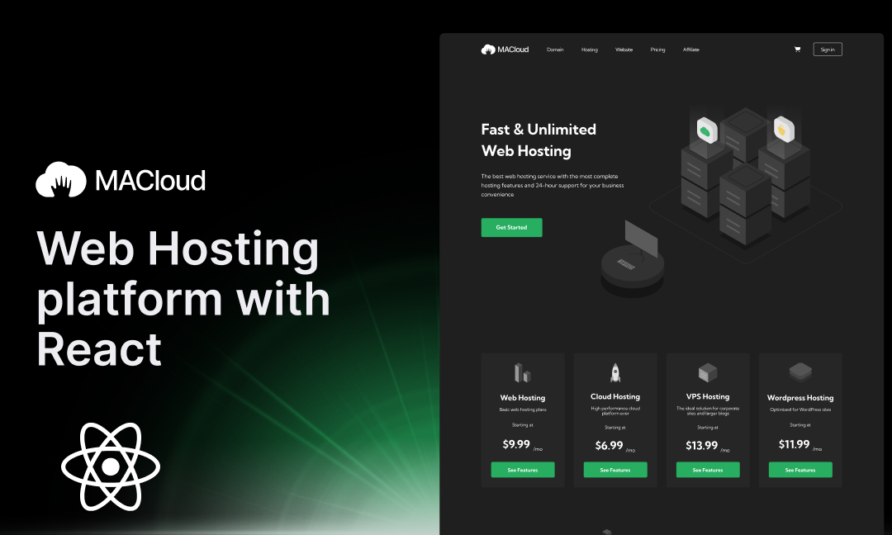

# MACloud - Web Hosting Service

<p align="center">
  
</p>

A modern, responsive web hosting service website built with React and Vite.

## 🚀 Live Demo

Visit the live site: [https://mxd0-0.github.io/MACloud/](https://mxd0-0.github.io/MACloud/)

## 📋 Features

- **Responsive Design**: Works seamlessly on desktop, tablet, and mobile devices
- **Modern UI**: Built with React and styled with Tailwind CSS
- **Fast Performance**: Optimized with Vite for lightning-fast loading
- **Hosting Products**: Showcase of web hosting, cloud hosting, VPS, and WordPress hosting
- **24/7 Support**: Dedicated support section highlighting customer service
- **Interactive Components**: Engaging hero section, testimonials, and guarantee sections

## 🛠️ Development

### Prerequisites

- Node.js (version 18 or later)
- npm or yarn

### Getting Started

1. Clone the repository:
```bash
git clone https://github.com/mxd0-0/MACloud.git
cd MACloud
```

2. Install dependencies:
```bash
npm install
```

3. Start the development server:
```bash
npm run dev
```

4. Open [http://localhost:5173](http://localhost:5173) to view it in the browser.

### Available Scripts

- `npm run dev` - Start development server
- `npm run build` - Build for production
- `npm run preview` - Preview production build locally
- `npm run lint` - Run ESLint for code quality
- `npm run deploy` - Build the project (deployment happens automatically on push to master)

## 🚀 Deployment

This project is automatically deployed to GitHub Pages using GitHub Actions. Every push to the `master` branch triggers a new deployment.

### Manual Deployment Steps

If you need to deploy manually:

1. Ensure all changes are committed and pushed to the `master` branch
2. GitHub Actions will automatically:
   - Install dependencies
   - Build the project
   - Deploy to GitHub Pages

The site will be available at: `https://[username].github.io/MACloud/`

### Local Preview of Production Build

To preview the production build locally:

```bash
npm run build
npm run preview
```

## 🏗️ Project Structure

```
MACloud/
├── public/          # Static assets
├── src/
│   ├── components/  # Reusable React components
│   ├── pages/       # Page components
│   ├── sections/    # Section components
│   ├── assets/      # Images, icons, and other assets
│   ├── App.jsx      # Main App component
│   └── main.jsx     # Entry point
├── .github/
│   └── workflows/   # GitHub Actions for deployment
├── dist/            # Built files (generated)
└── vite.config.js   # Vite configuration
```

## 🎨 Technology Stack

- **Framework**: React 19
- **Build Tool**: Vite 7
- **Styling**: Tailwind CSS 4
- **Icons**: React Icons & Heroicons
- **Deployment**: GitHub Pages with GitHub Actions
- **Code Quality**: ESLint

## 📝 License

This project is open source and available under the [MIT License](LICENSE).

---

## React + Vite Template Information

This template provides a minimal setup to get React working in Vite with HMR and some ESLint rules.

Currently, two official plugins are available:

- [@vitejs/plugin-react](https://github.com/vitejs/vite-plugin-react/blob/main/packages/plugin-react) uses [Babel](https://babeljs.io/) for Fast Refresh
- [@vitejs/plugin-react-swc](https://github.com/vitejs/vite-plugin-react/blob/main/packages/plugin-react-swc) uses [SWC](https://swc.rs/) for Fast Refresh

## Expanding the ESLint configuration

If you are developing a production application, we recommend using TypeScript with type-aware lint rules enabled. Check out the [TS template](https://github.com/vitejs/vite/tree/main/packages/create-vite/template-react-ts) for information on how to integrate TypeScript and [`typescript-eslint`](https://typescript-eslint.io) in your project.
